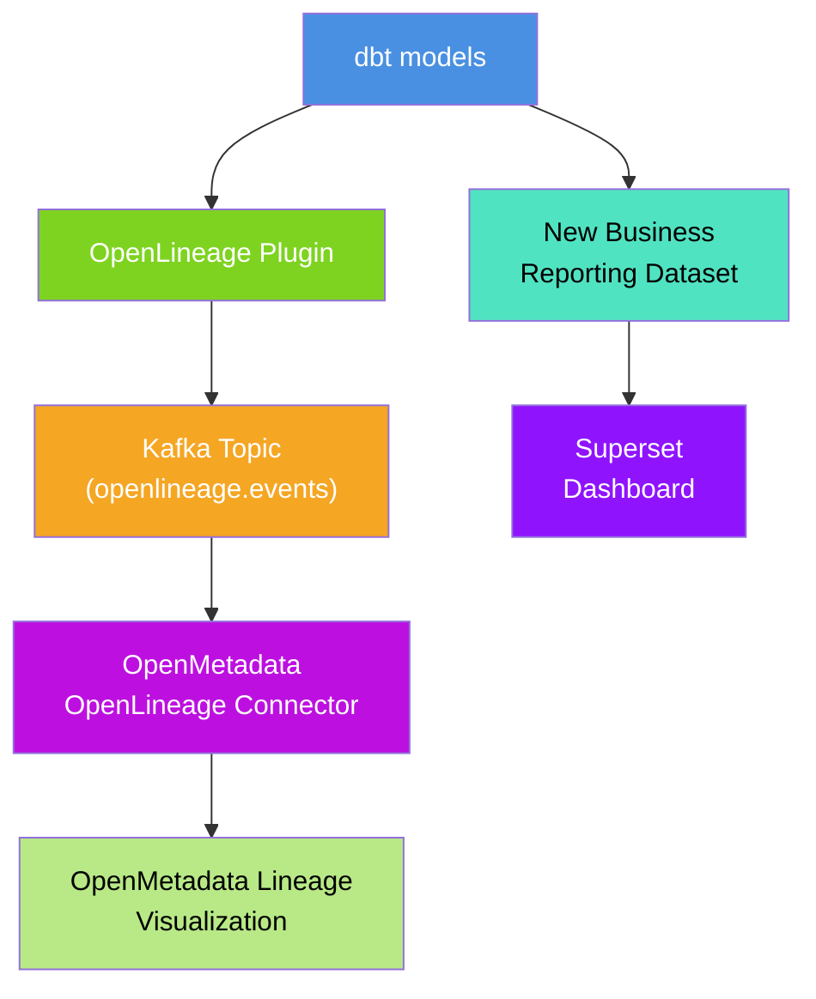

# OpenLineage Integration Deployment Plan

## Overview
Add OpenLineage integration to the existing dbt + OpenMetadata + Superset stack to capture data lineage metadata via Kafka. Create a new business reporting dataset in dbt to demonstrate end-to-end lineage propagation and visualization in OpenMetadata.

- [OpenLineage Integration Deployment Plan](#openlineage-integration-deployment-plan)
  - [Overview](#overview)
  - [Current State](#current-state)
  - [Target Architecture - Kafka + OpenMetadata Connector + Business Reporting](#target-architecture---kafka--openmetadata-connector--business-reporting)
  - [Phase 1: Environment Configuration](#phase-1-environment-configuration)
    - [Step 1.1: Create Lineage Directory Structure](#step-11-create-lineage-directory-structure)
    - [Step 1.2: Add Kafka Service](#step-12-add-kafka-service)
    - [Step 1.3: Create OpenLineage Configuration Files](#step-13-create-openlineage-configuration-files)
  - [Phase 2: Service Integration](#phase-2-service-integration)
    - [Step 2.1: Update Docker Compose Configuration](#step-21-update-docker-compose-configuration)
    - [Step 2.2: Configure dbt with Kafka Transport](#step-22-configure-dbt-with-kafka-transport)
    - [Step 2.3: Test OpenLineage Kafka Integration](#step-23-test-openlineage-kafka-integration)
  - [Phase 3: OpenMetadata OpenLineage Connector](#phase-3-openmetadata-openlineage-connector)
    - [Step 3.1: Configure OpenMetadata OpenLineage Connector](#step-31-configure-openmetadata-openlineage-connector)
    - [Step 3.2: Test Full dbt Lineage Generation](#step-32-test-full-dbt-lineage-generation)
    - [Step 3.3: Validate Lineage Data Quality in Kafka](#step-33-validate-lineage-data-quality-in-kafka)
  - [Phase 4: OpenMetadata Integration](#phase-4-openmetadata-integration)
    - [Step 4.1: Configure OpenLineage Ingestion in OpenMetadata](#step-41-configure-openlineage-ingestion-in-openmetadata)
    - [Step 4.2: Validate End-to-End Lineage Visualization](#step-42-validate-end-to-end-lineage-visualization)
    - [Step 4.3: Test Incremental Lineage Updates](#step-43-test-incremental-lineage-updates)
  - [Phase 5: Automation and Monitoring](#phase-5-automation-and-monitoring)
    - [Step 5.1: Integrate with Existing Makefile](#step-51-integrate-with-existing-makefile)
    - [Step 5.2: Set Up Monitoring and Health Checks](#step-52-set-up-monitoring-and-health-checks)
  - [Phase 6: Business Reporting Dataset Demo](#phase-6-business-reporting-dataset-demo)
    - [Step 6.1: Create New Business Reporting Models](#step-61-create-new-business-reporting-models)
    - [Step 6.2: Test OpenLineage Capture for New Models](#step-62-test-openlineage-capture-for-new-models)
    - [Step 6.3: Verify OpenMetadata Lineage Visualization](#step-63-verify-openmetadata-lineage-visualization)
    - [Step 6.4: Create Superset Dashboard for Business Metrics](#step-64-create-superset-dashboard-for-business-metrics)
  - [Phase 7: Documentation and Testing](#phase-7-documentation-and-testing)
    - [Step 7.1: Create Comprehensive Documentation](#step-71-create-comprehensive-documentation)
  - [Troubleshooting](#troubleshooting)
  - [Rollback Plan](#rollback-plan)
    - [Immediate Rollback (\< 5 minutes)](#immediate-rollback--5-minutes)
    - [Full Rollback (\< 15 minutes)](#full-rollback--15-minutes)
  - [Risk Assessment](#risk-assessment)
    - [Low Risk](#low-risk)
    - [Medium Risk](#medium-risk)
    - [Mitigation Strategies](#mitigation-strategies)
  - [Success Metrics](#success-metrics)
    - [Technical Metrics](#technical-metrics)
    - [User Experience Metrics](#user-experience-metrics)
    - [Operational Metrics](#operational-metrics)


## Current State
- ✅ dbt-jaffle-shop running in Docker container
- ✅ PostgreSQL database with jaffle_db
- ✅ OpenMetadata server with Elasticsearch
- ✅ Apache Superset for visualization
- ✅ `openlineage-dbt==1.35.0` already in requirements.txt

## Target Architecture - Kafka + OpenMetadata Connector + Business Reporting


**Selected Implementation**: Kafka transport + OpenMetadata OpenLineage Connector + Business Use Case Demo
- ✅ Native OpenMetadata integration via OpenLineage Connector
- ✅ Real-time event streaming through Kafka
- ✅ Scalable message broker architecture
- ✅ Standard OpenLineage format
- ✅ No file management or API polling required
- ✅ **New business reporting dataset to demonstrate lineage propagation**
- ⚠️ Additional Kafka service complexity (standard for enterprise)

---

## Phase 1: Environment Configuration

### Step 1.1: Create Lineage Directory Structure
**Task**: Create directories for Kafka configuration and OpenLineage setup
```bash
mkdir -p kafka/{config,data,logs}
mkdir -p dbt-jaffle-shop/lineage
```

**Success Criteria**:
- [x] Directory `kafka/` exists for Kafka broker configuration
- [x] Directory `dbt-jaffle-shop/lineage/` exists for OpenLineage config
- [x] Directories have proper write permissions for containers

### Step 1.2: Add Kafka Service
**Task**: Add Kafka and Zookeeper services to docker-compose.yml
- Add Zookeeper coordination service
- Add Kafka broker for OpenLineage events
- Configure Kafka topics for lineage data

**Success Criteria**:
- [x] Zookeeper service added to docer-compose.yml
- [x] Kafka broker service added to docker-compose.yml
- [x] Kafka accessible at `kafka:9092` for internal services
- [x] Kafka UI accessible at `localhost:9021` for monitoring

### Step 1.3: Create OpenLineage Configuration Files
**Task**: Create configuration files for Kafka transport

**dbt OpenLineage Config (`dbt-jaffle-shop/openlineage.yml`)**:
```yaml
type: kafka
config:
  bootstrap_servers:
    - kafka:9092
  topic: openlineage.events
  acks: all
  retries: 3
  compression_type: gzip
```

**Kafka Topics Configuration (`kafka/setup-topics.sh`)**:
```bash
#!/bin/bash
# Create OpenLineage topic
kafka-topics --create \
  --bootstrap-server kafka:29092 \
  --topic openlineage.events \
  --partitions 3 \
  --replication-factor 1 \
  --config retention.ms=604800000
```

**Success Criteria**:
- [x] dbt OpenLineage config uses Kafka transport
- [x] Kafka topic for OpenLineage events created
- [x] Topic retention configured for 7 days

---

## Phase 2: Service Integration

### Step 2.1: Update Docker Compose Configuration
**Task**: Add Kafka ecosystem services to docker-compose.yml

**Docker Compose Addition**:
```yaml
zookeeper:
  image: confluentinc/cp-zookeeper:7.4.0
  container_name: zookeeper
  environment:
    ZOOKEEPER_CLIENT_PORT: 2181
    ZOOKEEPER_TICK_TIME: 2000
  volumes:
    - zookeeper-data:/var/lib/zookeeper/data
  networks:
    - openmetadata_network

kafka:
  image: confluentinc/cp-kafka:7.4.0
  container_name: kafka
  depends_on:
    - zookeeper
  ports:
    - "9092:9092"
    - "9093:9093"
  environment:
    KAFKA_BROKER_ID: 1
    KAFKA_ZOOKEEPER_CONNECT: zookeeper:2181
    KAFKA_LISTENERS: INTERNAL://kafka:29092,EXTERNAL://kafka:9092
    KAFKA_ADVERTISED_LISTENERS: INTERNAL://kafka:29092,EXTERNAL://localhost:9092
    KAFKA_LISTENER_SECURITY_PROTOCOL_MAP: INTERNAL:PLAINTEXT,EXTERNAL:PLAINTEXT
    KAFKA_INTER_BROKER_LISTENER_NAME: INTERNAL
    KAFKA_OFFSETS_TOPIC_REPLICATION_FACTOR: 1
    KAFKA_AUTO_CREATE_TOPICS_ENABLE: true
  volumes:
    - kafka-data:/var/lib/kafka/data
    - ./kafka/setup-topics.sh:/usr/local/bin/setup-topics.sh
  networks:
    - openmetadata_network
  healthcheck:
    test: ["CMD-SHELL", "kafka-topics --bootstrap-server kafka:9092 --list"]
    interval: 30s
    timeout: 10s
    retries: 5

kafka-ui:
  image: provectuslabs/kafka-ui:latest
  container_name: kafka-ui
  depends_on:
    - kafka
  ports:
    - "9021:8080"
  environment:
    KAFKA_CLUSTERS_0_NAME: openlineage
    KAFKA_CLUSTERS_0_BOOTSTRAPSERVERS: kafka:29092
  networks:
    - openmetadata_network

volumes:
  zookeeper-data:
  kafka-data:
```

**Success Criteria**:
- [x] Zookeeper service added with persistent storage
- [x] Kafka broker service added with external and internal listeners
- [x] Kafka UI added for monitoring and debugging
- [ ] Health checks configured and passing
- [ ] All services use openmetadata_network

### Step 2.2: Configure dbt with Kafka Transport
**Task**: Update dbt container to use Kafka OpenLineage transport

**dbt Environment Variables**:
```yaml
# In docker-compose.yml dbt service
environment:
  - DBT_PROFILES_DIR=/app/profiles
  - OPENLINEAGE_CONFIG=/app/openlineage.yml
  - KAFKA_BOOTSTRAP_SERVERS=kafka:29092
```

**dbt Volume Mount**:
```yaml
# Add to dbt service volumes
volumes:
  - ./dbt-jaffle-shop:/app
  - ./dbt-jaffle-shop/openlineage.yml:/app/openlineage.yml
```

**dbt Dependencies Update**:
```yaml
# Add to dbt service depends_on
depends_on:
  - postgres
  - kafka
```

**Success Criteria**:
- [x] `OPENLINEAGE_CONFIG` environment variable set in dbt container
- [x] OpenLineage config file mounted in dbt container
- [x] dbt can reach Kafka at `kafka:29092`
- [x] dbt service depends on Kafka service
- [x] No breaking changes to existing dbt functionality

### Step 2.3: Test OpenLineage Kafka Integration
**Task**: Verify dbt can send events to Kafka topic
```bash
# Test Kafka broker health
docker exec kafka kafka-topics --bootstrap-server kafka:29092 --list

# Create OpenLineage topic
docker exec kafka kafka-topics --create \
  --bootstrap-server kafka:29092 \
  --topic openlineage.events \
  --partitions 3 \
  --replication-factor 1

# Run simple dbt command with OpenLineage
dbt run --select stg_customers

# Check Kafka topic for OpenLineage events
docker exec kafka kafka-console-consumer \
  --bootstrap-server kafka:29092 \
  --topic openlineage.events \
  --from-beginning --max-messages 5
```

**Success Criteria**:
- [z] Kafka broker responds to topic listing
- [z] OpenLineage topic created successfully
- [z] dbt run completes successfully
- [z] OpenLineage events sent to Kafka topic
- [z] Events visible in Kafka consumer output
- [z] No Kafka connection errors

---

## Phase 3: OpenMetadata OpenLineage Connector

### Step 3.1: Configure OpenMetadata OpenLineage Connector
**Task**: Set up OpenMetadata to consume OpenLineage events from Kafka
- Configure OpenLineage ingestion pipeline in OpenMetadata
- Set up Kafka consumer configuration for lineage events

**OpenMetadata OpenLineage Connector Configuration**:
```yaml
# OpenLineage ingestion pipeline in OpenMetadata
source:
  type: openlineage
  serviceName: dbt-kafka-openlineage
  serviceConnection:
    config:
      type: Kafka
      bootstrapServers: kafka:9092
      topicName: openlineage.events
      consumerConfig:
        group.id: openmetadata-lineage
        auto.offset.reset: earliest
        enable.auto.commit: true
```

**OpenMetadata Environment Update**:
```yaml
# Add to OpenMetadata service in docker-compose.yml
environment:
  - KAFKA_BOOTSTRAP_SERVERS=kafka:9092
  - OPENLINEAGE_KAFKA_TOPIC=openlineage.events
depends_on:
  - kafka
  - elasticsearch
  - mysql
```

**Success Criteria**:
- [ ] OpenMetadata OpenLineage connector configured for Kafka
- [ ] Kafka consumer group configured for OpenMetadata
- [ ] OpenMetadata service depends on Kafka
- [ ] Connector can read from openlineage.events topic
- [ ] No errors in OpenMetadata ingestion logs

### Step 3.2: Test Full dbt Lineage Generation
**Task**: Run complete dbt project and verify lineage capture to Kafka
```bash
# Full dbt workflow with lineage
dbt seed && dbt run && dbt test

# Monitor Kafka topic for lineage events
docker exec kafka kafka-console-consumer \
  --bootstrap-server kafka:29092 \
  --topic openlineage.events \
  --from-beginning | jq '.'
```

**Success Criteria**:
- [ ] All dbt commands execute successfully
- [ ] OpenLineage events sent to Kafka for each operation
- [ ] Kafka topic receives complete lineage events
- [ ] Seed → staging → marts relationships captured
- [ ] Column-level lineage included where applicable
- [ ] Test results and data quality events captured

### Step 3.3: Validate Lineage Data Quality in Kafka
**Task**: Verify collected lineage data completeness and accuracy in Kafka topic
```bash
# Check Kafka topic metrics
docker exec kafka kafka-run-class kafka.tools.GetOffsetShell \
  --broker-list kafka:29092 \
  --topic openlineage.events

# Sample lineage events from topic
docker exec kafka kafka-console-consumer \
  --bootstrap-server kafka:29092 \
  --topic openlineage.events \
  --max-messages 10 | jq '.eventType'
```

**Success Criteria**:
- [ ] All dbt models generate lineage events in Kafka
- [ ] All dbt runs generate job events in Kafka
- [ ] Lineage relationships are correct and complete
- [ ] Timestamps are accurate in events
- [ ] No missing or duplicate lineage entries
- [ ] Event schema matches OpenLineage specification

---

## Phase 4: OpenMetadata Integration

### Step 4.1: Configure OpenLineage Ingestion in OpenMetadata
**Task**: Set up OpenMetadata to read lineage data from Kafka using OpenLineage Connector
- Configure OpenLineage ingestion pipeline in OpenMetadata UI
- Set up Kafka consumer for real-time lineage ingestion

**OpenMetadata Ingestion Pipeline Configuration**:
1. Navigate to **Settings > Services > Pipeline Services**
2. Add **OpenLineage** service:
```yaml
Service Name: dbt-openlineage-kafka
Service Type: OpenLineage
Connection Config:
  Kafka Config:
    Bootstrap Servers: kafka:9092
    Topic Name: openlineage.events
    Consumer Group: openmetadata-lineage-consumer
```

3. Create **Ingestion Pipeline**:
```yaml
Pipeline Name: dbt-kafka-lineage-ingestion
Source: dbt-openlineage-kafka
Processor: OpenLineage
Sink: OpenMetadata
Schedule: Real-time (Kafka consumer)
```

**Success Criteria**:
- [ ] OpenMetadata OpenLineage service configured for Kafka
- [ ] Ingestion pipeline created and running
- [ ] Pipeline can connect to Kafka topic
- [ ] Lineage data successfully ingested from Kafka
- [ ] No errors in OpenMetadata ingestion logs

### Step 4.2: Validate End-to-End Lineage Visualization
**Task**: Verify complete lineage flow appears in OpenMetadata UI
- Check dbt model lineage graphs
- Verify data transformation tracking
- Confirm column-level lineage

**OpenMetadata UI Validation**:
```bash
# Access OpenMetadata UI
open http://localhost:8585

# Check lineage for key models
# Navigate to: Data Assets > Tables > jaffle_shop_dev > customers
# Verify lineage graph shows: raw_customers → stg_customers → customers
```

**Success Criteria**:
- [ ] dbt models appear in OpenMetadata catalog with full metadata
- [ ] Lineage graph shows complete seed → staging → marts flow
- [ ] Column-level lineage captured and displayed correctly
- [ ] Transformation logic documented in lineage
- [ ] Run history and data quality metrics visible
- [ ] Lineage updates automatically with each dbt run

### Step 4.3: Test Incremental Lineage Updates
**Task**: Verify lineage updates with model changes and multiple runs via Kafka
- Modify a dbt model
- Run dbt and check Kafka events
- Verify OpenMetadata ingests updates in real-time

**Test Scenarios**:
```bash
# Test 1: Model modification
# Modify models/staging/stg_customers.sql
dbt run --select stg_customers
# Check Kafka topic for new events
docker exec kafka kafka-console-consumer \
  --bootstrap-server kafka:29092 \
  --topic openlineage.events \
  --max-messages 5 | grep -i stg_customers

# Test 2: New model addition
# Create new model in models/marts/
dbt run
# Verify new events in Kafka and OpenMetadata

# Test 3: Multiple consecutive runs
dbt run && dbt run && dbt run
# Check that OpenMetadata shows run history from Kafka
```

**Success Criteria**:
- [ ] Kafka captures model changes in real-time
- [ ] OpenMetadata reflects updated lineage within 30 seconds
- [ ] Historical lineage runs preserved from Kafka events
- [ ] No duplicate or conflicting lineage entries
- [ ] Run metadata (timestamps, success/failure) captured
- [ ] Schema changes reflected in lineage via Kafka events

---

## Phase 5: Automation and Monitoring

### Step 5.1: Integrate with Existing Makefile
**Task**: Update Makefile to include Kafka and OpenLineage management
```makefile
# Updated Makefile targets
.PHONY: kafka-start kafka-topics kafka-logs dbt-run-with-lineage

kafka-start:
	@echo "Starting Kafka ecosystem..."
	docker compose up -d zookeeper kafka kafka-ui
	@echo "Waiting for Kafka to be ready..."
	@until docker exec kafka kafka-topics --bootstrap-server kafka:29092 --list > /dev/null 2>&1; do sleep 2; done
	@echo "Creating OpenLineage topic..."
	docker exec kafka kafka-topics --create --if-not-exists \
		--bootstrap-server kafka:29092 \
		--topic openlineage.events \
		--partitions 3 --replication-factor 1
	@echo "Kafka ready for OpenLineage!"

kafka-topics:
	docker exec kafka kafka-topics --bootstrap-server kafka:9092 --list

kafka-logs:
	docker compose logs -f kafka

dbt-run-with-lineage: kafka-start
	@echo "Running dbt with OpenLineage to Kafka..."
	docker exec dbt-jaffle-shop dbt run
	@echo "Checking lineage events in Kafka..."
	docker exec kafka kafka-console-consumer \
		--bootstrap-server kafka:29092 \
		--topic openlineage.events \
		--max-messages 5 --timeout-ms 5000

stack-up: kafka-start
	# Existing stack-up with Kafka integration
```

**Success Criteria**:
- [ ] Makefile includes Kafka ecosystem management
- [ ] `make dbt-run-with-lineage` works end-to-end with Kafka
- [ ] Kafka health checks integrated
- [ ] OpenLineage topic creation automated
- [ ] Error handling for Kafka failures

### Step 5.2: Set Up Monitoring and Health Checks
**Task**: Add comprehensive monitoring for OpenLineage Kafka system
- Monitor Kafka broker health and topic status
- Track lineage event production and consumption
- Set up alerts for missing lineage events

**Monitoring Implementation**:
```bash
# Health check script
#!/bin/bash
echo "Checking OpenLineage Kafka system health..."

# Check Kafka broker health
if ! docker exec kafka kafka-topics --bootstrap-server kafka:9092 --list > /dev/null 2>&1; then
    echo "❌ Kafka broker not responding"
    exit 1
fi

# Check OpenLineage topic exists
if ! docker exec kafka kafka-topics --bootstrap-server kafka:9092 --describe --topic openlineage.events > /dev/null 2>&1; then
    echo "❌ OpenLineage topic not found"
    exit 1
fi

# Check recent lineage events
LATEST_OFFSET=$(docker exec kafka kafka-run-class kafka.tools.GetOffsetShell \
  --broker-list kafka:9092 --topic openlineage.events --time -1 | cut -d: -f3)
if [ "$LATEST_OFFSET" -eq 0 ]; then
    echo "⚠️  No lineage events found in Kafka topic"
fi

# Check OpenMetadata ingestion status
if ! curl -f http://localhost:8585/api/v1/services/ingestionPipelines > /dev/null 2>&1; then
    echo "⚠️  Cannot check OpenMetadata ingestion status"
fi

echo "✅ OpenLineage Kafka system healthy"
```

**Success Criteria**:
- [ ] Kafka broker health monitoring implemented
- [ ] OpenLineage topic monitoring configured
- [ ] Event production/consumption metrics tracked
- [ ] OpenMetadata ingestion pipeline monitoring
- [ ] Automated alerts for system issues

---

## Phase 6: Business Reporting Dataset Demo

### Step 6.1: Create New Business Reporting Models
**Task**: Build new dbt models that demonstrate a realistic business use case
- Create customer analytics reporting dataset
- Build revenue analysis models
- Add geographic performance metrics

**New Business Model: `models/reports/customer_lifetime_value.sql`**:
```sql
-- Customer Lifetime Value analysis for business reporting
{{
  config(
    materialized='table',
    post_hook="CREATE INDEX IF NOT EXISTS idx_clv_customer ON {{ this }} (customer_id)"
  )
}}

WITH customer_orders AS (
  SELECT 
    customer_id,
    COUNT(*) as total_orders,
    SUM(amount) as total_revenue,
    MIN(order_date) as first_order_date,
    MAX(order_date) as last_order_date,
    AVG(amount) as avg_order_value
  FROM {{ ref('orders') }}
  GROUP BY customer_id
),

customer_details AS (
  SELECT 
    customer_id,
    first_name || ' ' || last_name as customer_name
  FROM {{ ref('customers') }}
),

location_metrics AS (
  SELECT 
    l.name as location_name,
    l.latitude,
    l.longitude,
    COUNT(DISTINCT o.customer_id) as unique_customers,
    SUM(o.amount) as location_revenue
  FROM {{ ref('orders') }} o
  JOIN {{ ref('locations') }} l ON o.location_id = l.location_id
  GROUP BY l.location_id, l.name, l.latitude, l.longitude
)

SELECT 
  co.customer_id,
  cd.customer_name,
  co.total_orders,
  co.total_revenue,
  co.avg_order_value,
  co.first_order_date,
  co.last_order_date,
  EXTRACT(DAYS FROM (co.last_order_date - co.first_order_date)) as customer_lifespan_days,
  CASE 
    WHEN co.total_revenue > 1000 THEN 'High Value'
    WHEN co.total_revenue > 500 THEN 'Medium Value'
    ELSE 'Low Value'
  END as customer_segment,
  CURRENT_TIMESTAMP as analysis_date
FROM customer_orders co
JOIN customer_details cd ON co.customer_id = cd.customer_id
```

**New Business Model: `models/reports/geographic_performance.sql`**:
```sql
-- Geographic performance analysis using location data
{{
  config(
    materialized='view'
  )
}}

SELECT 
  l.name as location_name,
  l.latitude,
  l.longitude,
  COUNT(DISTINCT o.order_id) as total_orders,
  COUNT(DISTINCT o.customer_id) as unique_customers,
  SUM(o.amount) as total_revenue,
  AVG(o.amount) as avg_order_value,
  SUM(oi.quantity) as total_items_sold,
  COUNT(DISTINCT p.product_id) as products_sold,
  ROUND(SUM(o.amount) / COUNT(DISTINCT o.customer_id), 2) as revenue_per_customer
FROM {{ ref('orders') }} o
JOIN {{ ref('locations') }} l ON o.location_id = l.location_id
JOIN {{ ref('order_items') }} oi ON o.order_id = oi.order_id
JOIN {{ ref('products') }} p ON oi.product_id = p.product_id
GROUP BY l.location_id, l.name, l.latitude, l.longitude
ORDER BY total_revenue DESC
```

**New Business Model: `models/reports/monthly_business_summary.sql`**:
```sql
-- Monthly business performance summary
{{
  config(
    materialized='incremental',
    unique_key=['year_month'],
    on_schema_change='sync_all_columns'
  )
}}

WITH monthly_aggregates AS (
  SELECT 
    DATE_TRUNC('month', order_date) as year_month,
    COUNT(DISTINCT order_id) as total_orders,
    COUNT(DISTINCT customer_id) as unique_customers,
    SUM(amount) as total_revenue,
    AVG(amount) as avg_order_value
  FROM {{ ref('orders') }}
  
    WHERE order_date >= (SELECT MAX(year_month) FROM {{ this }})
  
  GROUP BY DATE_TRUNC('month', order_date)
),

product_performance AS (
  SELECT 
    DATE_TRUNC('month', o.order_date) as year_month,
    COUNT(DISTINCT oi.product_id) as products_sold,
    SUM(oi.quantity) as total_quantity
  FROM {{ ref('orders') }} o
  JOIN {{ ref('order_items') }} oi ON o.order_id = oi.order_id
  
    WHERE o.order_date >= (SELECT MAX(year_month) FROM {{ this }})
  
  GROUP BY DATE_TRUNC('month', o.order_date)
)

SELECT 
  ma.year_month,
  ma.total_orders,
  ma.unique_customers,
  ma.total_revenue,
  ma.avg_order_value,
  pp.products_sold,
  pp.total_quantity,
  LAG(ma.total_revenue) OVER (ORDER BY ma.year_month) as prev_month_revenue,
  ROUND(
    ((ma.total_revenue - LAG(ma.total_revenue) OVER (ORDER BY ma.year_month)) 
     / LAG(ma.total_revenue) OVER (ORDER BY ma.year_month)) * 100, 2
  ) as revenue_growth_pct,
  CURRENT_TIMESTAMP as report_generated_at
FROM monthly_aggregates ma
JOIN product_performance pp ON ma.year_month = pp.year_month
ORDER BY ma.year_month
```

**Success Criteria**:
- [ ] New business reporting models created successfully
- [ ] Models demonstrate realistic business use cases
- [ ] Complex lineage relationships established (joining multiple tables)
- [ ] Models reference existing staging and mart tables

### Step 6.2: Test OpenLineage Capture for New Models
**Task**: Run the new business models and verify OpenLineage captures complete lineage
- Execute new reporting models
- Monitor Kafka topic for lineage events
- Verify complex dependency chains are captured

**Testing Commands**:
```bash
# Run the new business reporting models
dbt run --models reports

# Monitor Kafka for new lineage events
docker exec kafka kafka-console-consumer \
  --bootstrap-server kafka:9092 \
  --topic openlineage.events \
  --max-messages 20 | jq '.job.name'

# Check specific model lineage capture
dbt run --models customer_lifetime_value
docker exec kafka kafka-console-consumer \
  --bootstrap-server kafka:9092 \
  --topic openlineage.events \
  --max-messages 5 | jq '.inputs[].name'
```

**Success Criteria**:
- [ ] All new reporting models run successfully
- [ ] OpenLineage events captured for each model in Kafka
- [ ] Complex join relationships reflected in lineage events
- [ ] Column-level lineage captured for key transformations
- [ ] Incremental models generate appropriate lineage metadata

### Step 6.3: Verify OpenMetadata Lineage Visualization
**Task**: Validate that new business models appear in OpenMetadata with complete lineage
- Check lineage graphs in OpenMetadata UI
- Verify upstream and downstream relationships
- Confirm column-level lineage tracking

**OpenMetadata Verification**:
```bash
# Access OpenMetadata UI
open http://localhost:8585

# Navigate to new business tables:
# 1. Data Assets > Tables > jaffle_shop_dev > customer_lifetime_value
# 2. Check lineage tab - should show:
#    - orders → customer_lifetime_value
#    - customers → customer_lifetime_value  
#    - locations → geographic_performance
#    - Multiple table joins in monthly_business_summary

# Verify column lineage:
# Click on specific columns to see transformation lineage
# Example: customer_lifetime_value.total_revenue should trace to orders.amount
```

**Expected Lineage Relationships**:
1. **customer_lifetime_value**:
   - `orders` → `customer_lifetime_value` (revenue calculations)
   - `customers` → `customer_lifetime_value` (customer details)

2. **geographic_performance**:
   - `orders` → `geographic_performance`
   - `locations` → `geographic_performance`
   - `order_items` → `geographic_performance`
   - `products` → `geographic_performance`

3. **monthly_business_summary**:
   - `orders` → `monthly_business_summary`
   - `order_items` → `monthly_business_summary`

**Success Criteria**:
- [ ] All new business models visible in OpenMetadata catalog
- [ ] Lineage graphs show complete upstream dependencies
- [ ] Column-level lineage captured for key business metrics
- [ ] Transformation logic documented in lineage metadata
- [ ] Real-time updates reflect when models are re-run

### Step 6.4: Create Superset Dashboard for Business Metrics
**Task**: Build Superset dashboard using the new business reporting models
- Connect Superset to new business tables
- Create visualizations for business metrics
- Demonstrate end-to-end data flow from sources to dashboard

**Superset Dashboard Components**:
1. **Customer Lifetime Value Analysis**:
   - Customer segment distribution (pie chart)
   - CLV by customer segment (bar chart)
   - Top 10 customers by revenue (table)

2. **Geographic Performance**:
   - Revenue by location (map visualization using lat/lng)
   - Orders by location (scatter plot on map)
   - Location performance metrics (table)

3. **Monthly Business Trends**:
   - Revenue growth over time (line chart)
   - Monthly order volume (bar chart)
   - Customer acquisition trends (line chart)

**Dashboard Creation Steps**:
```bash
# Access Superset UI
open http://localhost:8088

# Create new dataset connections:
# 1. customer_lifetime_value table
# 2. geographic_performance view  
# 3. monthly_business_summary table

# Build dashboard with business KPIs
# Use the geographic coordinates for map visualizations
```

**Success Criteria**:
- [ ] Superset successfully connects to new business tables
- [ ] Dashboard displays real business metrics and KPIs
- [ ] Map visualizations work with geographic data
- [ ] Dashboard updates when dbt models are re-run
- [ ] Complete data lineage visible: raw data → staging → marts → reports → dashboard

---

## Phase 7: Documentation and Testing

### Step 7.1: Create Comprehensive Documentation
**Task**: Document complete OpenLineage integration for users
- Usage instructions for Kafka + OpenMetadata OpenLineage Connector
- Troubleshooting guide for Kafka and ingestion issues
- API reference for lineage data access

**Documentation Sections**:
```markdown
# OpenLineage Integration Guide

## Architecture
- OpenLineage events sent to Kafka topic from dbt
- OpenMetadata OpenLineage Connector consumes from Kafka
- Real-time lineage ingestion into OpenMetadata

## Usage
```bash
# Start full stack with Kafka and OpenLineage
make stack-up

# Run dbt with lineage capture to Kafka
make dbt-run-with-lineage

# Check lineage in OpenMetadata UI
open http://localhost:8585

# Monitor Kafka events
open http://localhost:9021  # Kafka UI
```

## Troubleshooting
- Kafka health: `docker exec kafka kafka-topics --bootstrap-server kafka:9092 --list`
- Topic events: `docker exec kafka kafka-console-consumer --bootstrap-server kafka:9092 --topic openlineage.events --max-messages 5`
- OpenMetadata ingestion: Check ingestion pipeline status in UI
```

**Success Criteria**:
- [ ] README.md updated with OpenLineage collector section
- [ ] API endpoints documented with examples
- [ ] Common issues and solutions provided
- [ ] Integration benefits and architecture explained
- [ ] User workflows clearly documented

### Step 7.2: End-to-End System Testing
**Task**: Comprehensive test of entire lineage flow with Kafka
```bash
# Fresh deployment test
make stack-down
make stack-up
make dbt-run-with-lineage

# Verify lineage in OpenMetadata
# Check Kafka topic
docker exec kafka kafka-console-consumer \
  --bootstrap-server kafka:9092 \
  --topic openlineage.events \
  --max-messages 10 | jq '.eventType'
```

**Test Scenarios**:
1. **Fresh Installation**: Clean deployment → lineage generation → Kafka → OpenMetadata → new business models → Superset dashboard
2. **Model Changes**: Modify business reporting model → run → verify Kafka events → check OpenMetadata updates → validate dashboard updates
3. **Error Recovery**: Stop Kafka → restart → verify data integrity and resume → check business model lineage continuity
4. **Performance**: Multiple concurrent dbt runs → check Kafka stability and OpenMetadata ingestion → validate business reporting performance
5. **Data Quality**: Verify lineage accuracy across all dbt operations via Kafka → validate business model dependencies
6. **Dashboard Integration**: Create Superset dashboard using business reporting models → verify real-time lineage tracking

**Success Criteria**:
- [ ] Fresh deployment generates complete lineage to Kafka
- [ ] All containers start successfully with dependencies
- [ ] dbt runs complete with lineage capture to Kafka topic
- [ ] OpenMetadata ingests lineage from Kafka in real-time
- [ ] **New business reporting models populate with accurate data**
- [ ] **Superset dashboards display business metrics with lineage tracking**
- [ ] Kafka topic contains valid OpenLineage events
- [ ] OpenMetadata OpenLineage Connector operates without errors
- [ ] System remains stable under normal load
- [ ] **Business model lineage relationships visible in OpenMetadata**

---

## Rollback Plan

### Immediate Rollback (< 5 minutes)
1. Revert `docker-compose.yml` changes (remove Kafka services)
2. Remove OpenLineage environment variables from dbt service
3. Restart containers: `make stack-restart`

### Full Rollback (< 15 minutes)
1. Revert all configuration files
2. Remove Kafka directories and volumes
3. Clean OpenMetadata OpenLineage ingestion pipelines
4. Restart full stack: `make stack-down && make stack-up`

---

## Risk Assessment

### Low Risk
- ✅ OpenLineage dependency already installed
- ✅ Kafka is industry-standard message broker
- ✅ No changes to core dbt functionality

### Medium Risk
- ⚠️ Additional Kafka infrastructure complexity
- ⚠️ Network configuration between services
- ⚠️ Increased resource usage for Kafka cluster

### Mitigation Strategies
- Use Kafka health checks and monitoring
- Configure proper service dependencies in docker-compose
- Monitor Kafka disk usage and log retention
- Test Kafka failover and recovery scenarios

---

## Success Metrics

### Technical Metrics
- [ ] 100% of dbt models generate lineage metadata
- [ ] < 5% increase in dbt run time due to lineage
- [ ] OpenMetadata lineage accuracy > 95%
- [ ] Zero data corruption or loss events

### User Experience Metrics
- [ ] Lineage visible in OpenMetadata within 1 minute of dbt run
- [ ] Complete end-to-end lineage from seeds to marts to business reports
- [ ] Column-level lineage captured for key transformations
- [ ] Historical lineage preserved across multiple runs
- [ ] **Business reporting models update within 2 minutes of source changes**
- [ ] **Dashboard metrics reflect real-time business data changes**

### Operational Metrics
- [ ] Automated lineage generation reliability > 99%
- [ ] Kafka topic event throughput > 1000 events/day
- [ ] OpenMetadata ingestion latency < 30 seconds
- [ ] Zero manual intervention required for normal operations
- [ ] Kafka cluster uptime > 99.9%
- [ ] **Business reporting models run successfully on every execution**
- [ ] **Business dashboard metrics accuracy > 98%**
